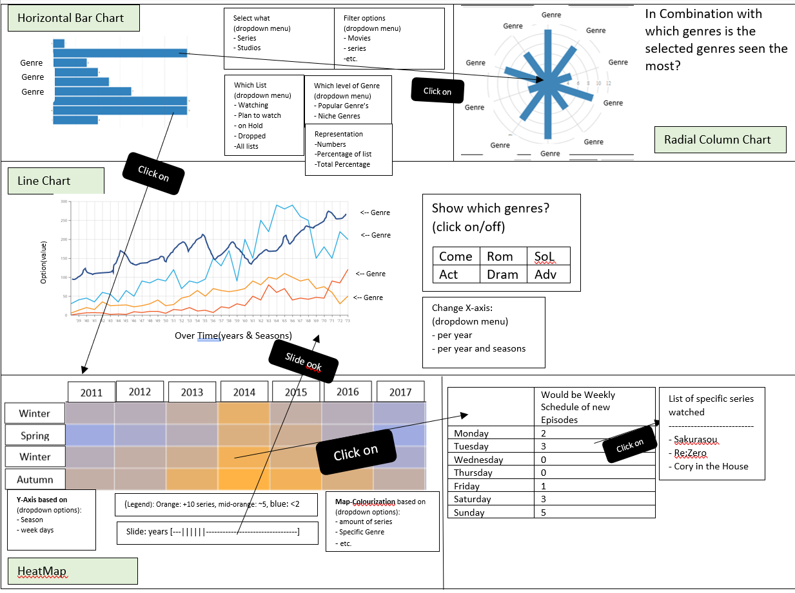
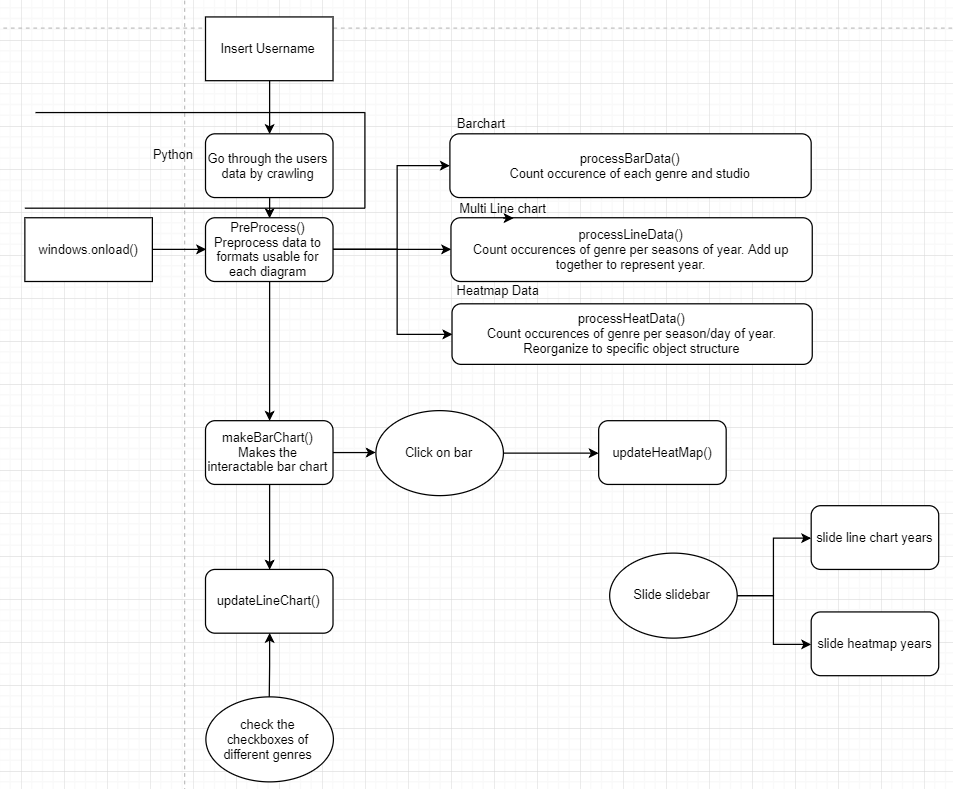

### Data sources
MAL will be the only data source of which info will be extracted by crawling through the lists
* My Account: https://myanimelist.net/animelist/Goblok?status=2
* Page to make graphs with percentile values: https://myanimelist.net/anime.php

Data that will be extracted are:
* title
* alternate titles
* time of release(Year, month, day, season)
* Creation Studio
* genres

Data is already extracted and transformed to usable {username}_{list-type}.JSON files
* list type number representing either: Completed, on-hold, dropped or plan-to-watch

### Diagram

### Descriptions
#### Give user data
The user is allowed to insert his/her own username and select which list of his/her account to extract. This individual selection is necessary due to a higher failure(mainly slight internet disturbances, might be my laptop's fault) rate of BeautifulSoup the longer the lists are and due to the time it will take to extract long lists.  

JS will call upon the .py file and data will be extracted by crawling in python.

If data is extracted it will be saved in a JSON file and thus can be called upon immediately instead of rescraping.
(error message for when the account does not exist in not yet implemented)

##### User Input Extra
When nothing is filled in use Goblok(my account) as data

#### Horizontal bar chart: D3
Will represent the amount of anime watched per genre or per studio. 1 anime can fall under multiple genres, thus the total value of the bars will exceed the actual amount of anime watched.  

###### Bar chart data
Extracted data will be preprocessed to an object in javascript per genre/studio with a single value to that genre/studio. This will happen by looping through each genre per anime entry and increment each genre's value
###### Bar Chart interactivity
* Hover over bar to see value or represent the values next to the bar
* Clicking on a genre will update the heatmap to that genre.  

#### Multi line chart: D3 & Multi line D3
Will represent the amount watched over years or over the seasons within those years.
##### Multi line chart Data
Reorganize the data by incrementing genre per season per year. If user selects "per seasons and year", then have the x-axis represent years and season. if user selects "per year" then add all values from the seasons in the same year and have the x-axis only represent the year.
##### Line Chart interactivity
* Check boxes will reflect which genres are represented in the line Chart
* slider of the heatmap will also influence line chart

#### Heatmap
* how-to D3-V4:https://blockbuilder.org/officeofjane/11b54880abcb6b844637cb1d7a120cd5
##### Heatmap Data
Reorganize the data to a [{Genre: "", Season/day: "", Year: "", Value: ""}] structure with value incrementing with each occurence of the genre found for that specific year  

##### Heatmap interactivity
* slider will influence which years are represented
* dropdown menu will change what is represented in the heatmap on the y-axis
######back-up options for heatmap:
* anychart: will need two modules to be imported [link](https://docs.anychart.com/Basic_Charts/Heat_Map_Chart)
   * 
   * 
* AMchart: will need two modules to be imported [link](https://www.amcharts.com/docs/v3/tutorials/heat-map-chart/)
   * 
   * 
##### Extra optional implementation
Select a box in the heatmap and a weekly schedule of that season/day will appear
