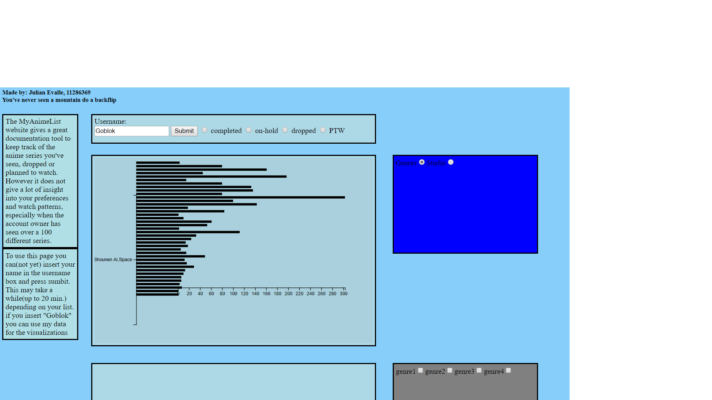

## day 1
  crawled usable data from the MAL-page

  note: had van het begin al de lijsten moeten opdelen in aparte JSON Files ipv van 1. Heb hele ochtend en halve middag verspilt aan slight internet connection errors door SP wifi
## day 2
  Stage-Training, dus weinig tot geen voortgang
## day 3
  * data pre-processed voor barchart
  * bar chart gemaakt, axis en keluringen zijn nog incorrect

  * note: mogelijk genre title indelen in lijst en lengte van de lijst optellen, maar incrementen van een getal per genre zal beter uitkomen omdat de lijst niet in de barchart gebruikt zal worden

  * note: split de studionamen die blijkbaar nog als 1 string worden gezien ipv van meerdere

  
  * heb de lay-out anders neergezet dan in de proposal, omdat het mij netter lijkt om ze in een apart vak te doen dan in hetzelfde vak, mogelijk chartvak verlengen zodat de buttonvak zich erin bevind, maar voor nu is dit gestructureerder
## day 4
  Stage-Training, dus weinig tot geen voortgang
## day 5
  * de multi-line chart met jaren en seizoenen als x-axis gaat misschien te lastig worden, dus voor nu zal het alleen jaren worden als x-axis
  * de slide bar zal een range representeren(e.g. 1997 --> 1987:2007), dit zal het makkelijker maken om de slide te implementeren, meerendeels omdat ik dan geen cut off point hoe neer te zetten en omdat je dan de slider niet naar een punt kan plaatsen waarbij alleen de halve chart data presenteert
    * Een knop om alle jaren te laten zien, zal ook mogelijk zijn. aangezien het interessante data is om te representeren
  * de selectie van welke MAL-list gebruikt zal worden is verplaatst van de barschart naar de insert username element, dit is makkelijker terug te vinden.
  * heb zoals gepland, de bar chart data gesplits tussen een grote groep en een kleine groep. de grens van de splitsing is geplaats op 50 (en bij studio 10) omdat het leek dat dat ongeveer een evenredige splitsing zou zorgen tussen de data.
    * later een dynamische grens implementeren, voor gebruikers met meer data
  * note to self: behoud de opties in hun eigen SVG, aangezien ze verplaats moeten worden indien ik extra grafieken ga gebruiken. Hierdoor kunnen ze makkelijk samen verplaats worden indien noodzakelijk
  * Heb de bargrafieken kunnen sorteren dmv D3, wat noodzakelijk is om de data begrijpelijk te presenteren.      
    * Indien tijd over overweeg ook dergelijke sortering op naam

## day 5.3(Saturday)
  * heb de radiobuttons data verdeeld tussen BD(Type data die gebruikt word: Genre of studio) en BT(Welk deel van de gekozen data het gebruikt de grote of kleine hoeveelheden)
  * heb de data structuur voor de multi-line chart aangepast, zodat het bruikbaar is voor de manier waarop [deze site](https://codepen.io/anon/pen/Jwewwg?editors=1012) zijn multi-line chart maakt
    *  note to self: proper credit geven
## day 5.6(Sunday)
 * Data voor de heatmap is geordend op een manier dat bruikbaar is voor de season-heatmap
 * elke chartdata is opgezet voor de genres, maar nog niet voor de studios, ten eerste zijn de genres neezetten belangrijker omdat het waarschijnlijk interessanter is voor de gebruiker. Maar studio zal uiteinderlijk worden opgezet

## day 6
 * heb de key voor value veranderd naar amount bij het preprocessen van de heatData omdat JS een numerieke waarde verwacht bij zo'n key
    * het vreemde is dat d3.max dan alsnog de correcte max kan vinden van een 0/NaN lijst
 * note to self: studios gaat sws niet de heatmap in, aangezien het geen interessante data zal representeren aangezien studios alleen maar een of twee releases hebben per seizoen
 * heatmap blokjes zijn geplaats, voor nu alle jaren ipv een segment, net als bij de line chart
   * een knop voor alle jaren zou interessant kunnen zijn, maar dat zou problematisch worden voor de jaren-labels

## day 7
 * bug gevonden in de scraper, wanneer studios zijn gescheiden met een ",". ziet de scraper dat niet(denk ik) alhoewel dat zou moeten met hoe het algoritme is neergezet.
   *  tijdelijke fix in de preprocess geplaats, moet weghalen na rescraping
 * voor de dynamische verdeling tussen barTypes is de median een logische keuze om de bars gelijk te verdelen tussen een small en een big list
   *  studioMedian krijgt +2 als het kleiner is dan 4, want dan zijn er waarschijnlijk heel veel studios, waarvan je maar een paar anime van hebt gezien
## day 8
  * update voor de barchart geimplementeerd, maar axisen updaten niet
  * update voor heatmap geimplementeerd en een prototype agenda
  * Link tussen barchart en heatmap geimplementeerd
      * nog neit mogelijk om dagen aan te tonen in de heatmap
  * link tussen heatmap en agenda geimplementeerd
## day 9
  * De slider beinvloed de heatmap en de heatmap is nu in bezit van een 10 jaar range, ipv alle jaren
      * wel lijken de data in de boxes niet correct mee te sliden(slider van 2007 --> 2008 zorgt voor dat de Winter 2007 box data komt te staan in de herfst 2007 box)
      * ook moeten de x labels verwijderd worden voordat de nieuwe x labels geplaats worden
 * heb de genre checkbox toevoeging dynamisch gemaakt, maar nog niet netjes in 1 box
 * nu er een selectie gemaakt moet worden voor de linechart zal de preprocessing van de lineData aangepast moeten worden naar lineData waaruit een selectie gemaakt kan worden en lineData die alle data klaar kan tonen
    * de checboxes zijn nog buggy wat betreft het plaatsen in hun box
## day 10
  * heb de axis transition kunnen fixen [hierdoor](https://bl.ocks.org/shimizu/914c769f05f1b2e1d09428c7eedd7f8a)
  * heb kleuren toegevoegd aan de bars. ik heb gekozen voor een aardig neutrale gradient van blauw aangezien het niet iets goeds noch slechts is om meer te hebben gezien van de ene genre/studio dan het ander
      * ik heb er ook voor gekozen om de big list max te nemen als domain.max omdat het dan meer een distinctie plaatst tussen de big en small list. anders lijkt het alsof de hoogste waarde van de small list (bijv: 12) even hoog is als de hoogste waarde van de big list(bijv. 303)
  * heb de kleur van line van elke genre een kleur toegekend, dit zorgt ervoor dat het minder verwarrend is wanneer het tussen linedata wisselt
## day 10.3 (Saturday)
 * heb de code ge-update volgense de style-guide
## day 11
 * heb ervoor gezorgd dat de lijsten kunnen worden gekozen vanuit de pagina zelf
 * heb een bug gevonden waarbij een genre geselecteerd kan worden via de bar, maar dat de heatchart geen idee wat het ermee aanmoet, omdat het preprocessing van de heatdata alles filtert als het seizoen onbekend, wat de bardata dus niet doet. dit zorgt ervoor dat data aanwezig is in de barchart die geheel afwezig is van de heatdata
    * mogelijk oplossing, een "unknown" data object maken die alle gefilterde entries oppikt en het in een vakje buiten de heatmap presenteert
* bug gevonden: wanneer je van 1 lijst naar een andere lijst wisselt krijg je een error wat betreft de checkboxes, omdat het programma checkt wat aangevinkt is en wat niet. de checkboxes zelf worden intieel gemaakt op basis van welke genres er worden gevonden in de completed list, maar als je dus wisselt naar een andere lijst en e is een discrepantie in genres tussen de twee lijsten, dan telt het teveel of te weinig waardoor er een error ontstaat
* heb de genrekeuzen kunnen laten update
    * nieuwe bug, de checkboxes kunnen niet meer gechecked of unchecked worden
* waarschijnlijk word het aantonen van een dag-heatmap los gelaten, niet omdat het preprocessen uitgebreid moet worden per se, maar eerder omdat het niet heel interessant is op welke dagen welke series waren uitgekomen, wel in welke season ze waren aangetoond.
* de bug van de heatmap is opgelost. probleem was dat het de waarde van een vakje op de verkeerde plek zou plaatsen na het sliden. Opgelost nadat de data geordend werd op seizoen en jaar. Niet zeker hoe dit een probleem veroorzaakte, aangezien de y coordinaat en grootte van de heatbox constant blijft, ongeacht of de data geordend is of niet. Het enige wat variabel was is de x, coordinaat, wat de heatboxjes op zn minst op de zelfde rij had moeten houden ipv hoger of lager
* note-to-self:
    * structuur van de pagina moet anders dan gepland. met name de heatmap moet verplaats worden naar iets dichterbij bij de bar chart om de transitie van de heatmap te zien bij een andere selectie van genre, maakt het ook makkelijker voor de gebruiker als hij/zij snel verschillen wilt zien tussen genres in de heatmap en dus niet omhoog en omlaag snel hoeft te scrollen. mogelijke opzet is [barchart - optiesbar en agenda en daarnaast de heatmap] horizontaal en eronder de line chart die de breedte van de bovenste helft heeft. mogelijk kan dan de genrekeuze voor de line chart eronder geplaatst worden geordend in vakjes
    *  studios zijn vreselijk oninteressant om te gebruiken in de andere visualisaties aangezien studios maar 2 producten creeeren per jaar, wat dus niet veel betekent in zowel de line als de heatchart, maar wel vreselijk interessant in de barchart simpelweg doordat totale kwantiteit nog iets kan zeggen(daarnaast maakt het dingen makkelijker voor mij).
* note: Filter de namen van de studio "add some" "none found"
## day 12
* heb de JSON files verplaatst naar een datamap\
* bug in scrapemal gevonden, programma werkt niet als de instellingen van de pagina plaatjes toelaten van desbetreffende entree in de lijst. dit zal opgemerkt worden in hoe de site gebruikt moet worden, aangezien het makkelijker is om de instellingen te veranderen dan het programma aan te passen en het een kleine moeite is voor de gebruiker zelf
* preprocess filtert nu studio "add some" en "none found"
* font sizes van heatmap vergroot
* heb de heatmap dichter bij de barchart geplaatst zodat de transitie van de heatmap makkelijker aanschout kan worden.
* de genres voor de linechart worden nu verdeeld in 2 vakken, maar nog steeds de bug als dat ik ze wil updaten dat de checkboxes neit meer  gechecked of ge unchecked kunnen worden
* labels van de barchart wroden nu groter of kleiner afhankelijk van hoeveel bars op het huidige moment
* note to self: nette structuur opzetten

## day 13
* moet de check/uncheck all buttons telkens opnieuw laten creeren, doordat anders de eerste paar checkboxes van de genres bij de linechart afwezig zijn door een bug die ik niet kan beredeneren
* bug: heatmap update zichzelf niet autoamtisch nadat er een nieuwe lijst word gekozen, moet eerst de slider verplaatsen dan pas update het zichzelf naar de nieuwe data
* barchart bug van transition opgelost, geen idee waarom, probleem bars blijven van grotere dataset naar kleienre. oplossing: on functies bove de transition en andere attributes geplaatst
*  username kan nu worden ingevoerd en checked of de file voor die user en specifieke lijst bestaat bestaat
* tijd gespendeerd om python op te roepen via ajax maar op zn best de script in text format opgehaald.
* de error die aanwezig was in de lineproprocess, waardoor er errors kwamen bij de linechart door van een lijst naar een andere te gaan is opgelost, maar heeft het probleem van de uncheckable checkboxes niet opgelost

## day 14
* heb de data van de account van een vriend gescraped, geen problemen met visualizatie, probleem wel dat bij veel minder data de labels van de barchart te groot worden, dus dit is een simpele maar worthwhile bug om te verhelpen
    * het concept om python op te roepen in javascript zal worden geschrapt doordat ik niet de tijd heb om te leren hoe AJAX werkt en de mechanismes van client en server side programmeren.
    * wel kan ik het nu simuleren, doordat ik 2 datasets heb en beide tonen interessante data voor de gebruiker zelf. Ook toont het aan dat het voor meerdere gebruikers toepasbaar is.
* tip gekregen: zou interessant zijn om de lengte van de lijst te tonen ergens in de barchart voor een wat beter kader buiten procenten
* note-to-self: heatmap toont producitejaar, niet gezientijd

## day 15
* Hackaton gebruikte significant meer tijd dan dat ik van plan was om het te geven. heb een Dope stress-ball aan over gehouden dus al is vergeven
* HEB DE LINECHART CHECKBOX BUG OPGELOST, het probleem zat hem in de manier dat updateLOptions werd opgeroepen telkens wanneer er een veradering hoort plaats te vinden in de line chart. Hoe de checkboxes werden geupdate was door alle divs(dus checkbox en label) te verwijderen in de Lineoption divs en nieuwe checkboxes aan te maken. Het probleem was dat de checkboxes niet meer uitgevinkt konden worden, maar wel ge-update omdat telkens alle checkboxes removed en aangemaakt worden. Het probleem hier is dus dat de property van alle checkboxes aangevinkt als default werden aangemaakt, dus wanneer je een checkbox probeerde uit te vinken kon je in de console een reactie zien, maar omdat alle checkboxes opnieuw werden aangemaakt met de default-vink zorgde dat ervoor dat de checkbox aangevinkt bleef. De oplossing hiervoor is door een variabele mee tegeven aan de updateLine() wanneer het opgeroepen wordt door de checkbox of de check/uncheck all. Deze variabele wordt gechecked in updateLines en slaat het opnieuw aanmaken van de checkboxes en dergelijke over. Dit is een indirecte manier om ook aan  het programma mee tegeven dat je niet van lijst aan het verwisselen bent en dus niet hoeft te updaten. bonus is dat je ook geen variabele hoeft mee te geven wanneer wisselt van gebruikers data

## day 16
* tip om een lange JS script te verdelen in meerdere scripts
* kleine bug met de slider was weer teruggekomen waarbij de default slidernummer niet werd geteken. heb het meegeven van callXaxisHeat weggehaald, heeft de bug en bijbehorende errors opgelost
* about-HTML pagina toegevoegd, verder nog gespeeld met CSS elementen, kan geaccessed worden linksboven bij de about-link
* de entries in de agenda zijn listitems, ziet er meer geordend uit

## day 17
* kleine bug in preprocessing, non-genress zoals "stress" & "upset" worden niet uitgefilterd, mogelijke oplossing is filteren op hoofdletter
