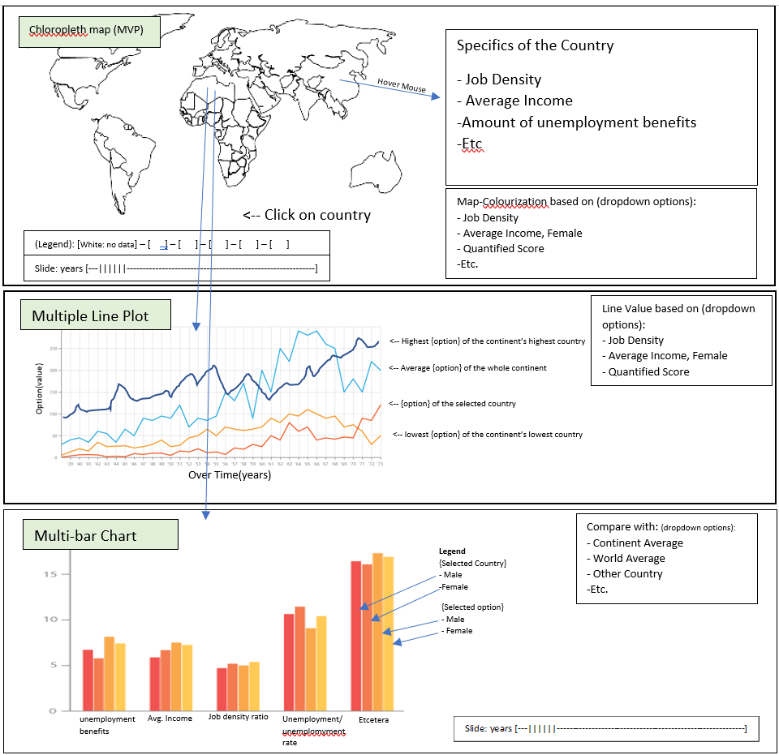

## DataVisualisationProject
###### Creator details
* Name: Julian Evalle
* Stud_ID: 11286369
* Orientation: Data Processing
###### Application Goal
To help unemployed people assess which country would give them the best odd of finding a job (assuming they can communicate with the people)

### Problem Statement
Unemployment is a worldwide phenomena and can wildly differ between countries.  
Can a visualization help assess what country gives the best job environment for an unemployed person.

### Solution
Visualizing certain details per country that help compare and assess  
which country gives the best chances for a job

### prerequisites
#### Dataset [ilo.org][ilo]
###### site does not allow links to specific parts
* Unemployment Rate per country
  * by percentage 
    * unemployment and labour underutilization --> unemployment rate by sex and age
  * by thousands 
    * unemployment and labour underutilization --> unemployment by sex and age
* Job Density / employment-to-population ratio per country
  * Employment --> employment-to-population ratio --> by sex and age
* Hourly wage per country
  * ILO modelled estimates --> Earning of employees
* GDP per country, can reflect the level of unemployment and wage
  * Earnings and labour cost --> labour income share --> by GDP
* unemployment benefits(% van mensen die werkeloosheidsuitkering krijgen)
  * Social protection --> social protection coverage -->Share of unemployed receiving regular periodic social security unemployment benefits by sex
* Amount of people no longer searching for a job for various reasons
  * unemployment and labour underutilization --> discouraged job-seekers
##### Data transformation
All the data needs to be reorganized so that every country belongs to its respective continent

#### libraries
* chloropleth map: D3 & d3.geomap
* Multi-line chart: D3 & D3 Multi-line chart
* Bar Chart: D3

#### similar
* the D3 example multi line chart [here](https://beta.observablehq.com/@mbostock/d3-multi-line-chart)
 * I will try something similar with fewer lines and more distinctive colouring and  
 with what each line represents (like in the sketch) I believe mine will be more informative
* the GDP per country visualization on [wikipedia](https://en.wikipedia.org/wiki/List_of_countries_by_GDP_(PPP)_per_capita#/media/File:Countries_by_GDP_(PPP)_per_capita_in_2017.png)
 * I would like something similar as well, but with a selection of options of what the colouring means and resepctive adjustment to the colouring per country
 
#### Hardest parts
* A way to quantify which country gives the best environment instead of just helping the viewer assess which country it is.
* connecting the lower 2 visualizations to the selected country
* Ordening the data of the countries to continents which may need long lists with country names per continent
* all the data needs to be read through manually to assess what would be the best year spans to visualize

[ilo]: http://www.ilo.org/ilostat/faces/wcnav_defaultSelection?_afrLoop=3534569229012209&_afrWindowMode=0&_afrWindowId=null#!%40%40%3F_afrWindowId%3Dnull%26_afrLoop%3D3534569229012209%26_afrWindowMode%3D0%26_adf.ctrl-state%3Dkunfunk1c_138
