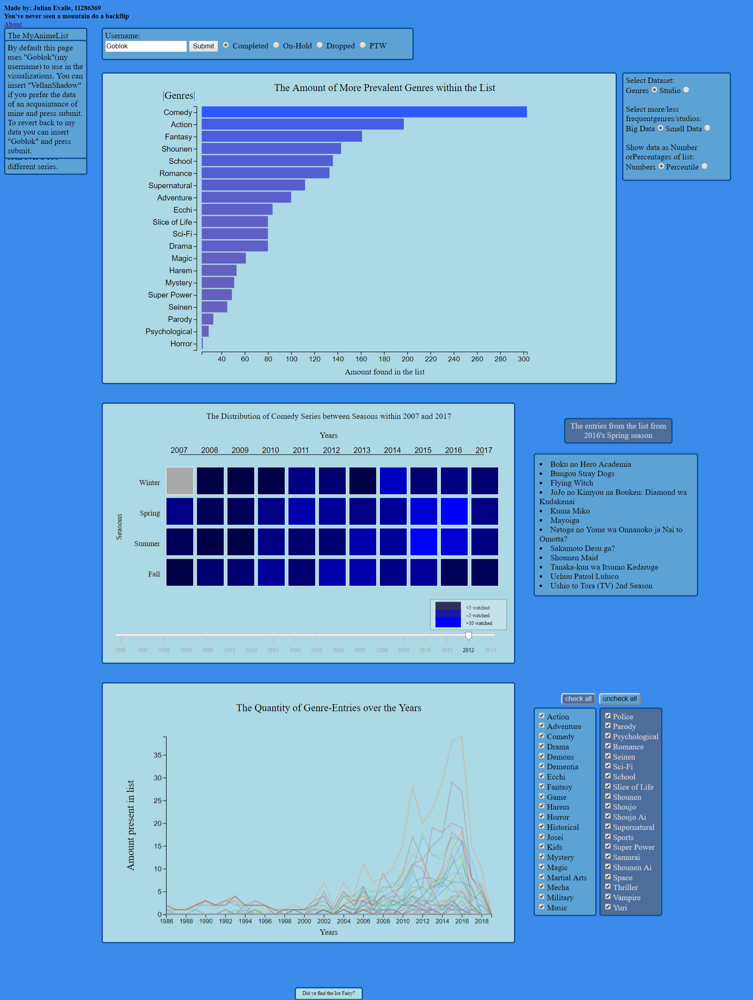

## DataVisualisationProject
### Application Details:
* Name Application: MAL-Visualizer
* Creator: Julian Evalle, student at University of Amsterdam
* Link to HTML: [Github](https://goblok0.github.io/DataVisualisationProject/code/html/mal.html)
### ScreenShot

* Picture shows a div-element overlapping with another, this is only present in the full-page screenshot, not in the HTML itself
### Purpose
* The purpose of this site and the underlying respective programming is to give the user more insight on their watching habits, according to their own [MyAnimeList](https://myanimelist.net). This is given by several visualizations each serving their own purpose. The Barchart can give insight about genre and studio preferences, which genres you prefer to watch in the future and which genres or studios you are likely to put on hold or stop watching midway through the serie itself. The Heatmap can give insight on seasonal viewing habits, most likely due to free time or which seasons make you feel more inclined to watch series. The Linechart gives a more concrete view on yearly viewing habits than the Heatmap and gives you a tool to compare certain genres with other genres, unlike the heatmap. A note should be made that the years and seasonal numbers represent the date of release of the series, and not necessarily the moment you watched it yourself, however noticable peaks in certain years or seasons are still representative of your viewing habits.
### Credits
The created programs make use of several pieces of code or functions written by other people:
* Scraper
  * MProg UvA: 
    * Template for crawler program and several functions within that program.
  * Micheal J Sanders: https://michaeljsanders.com/2017/05/12/scrapin-and-scrollin.html
    * Function for using Selenium, necessary for crawling extending pages
* Main (mal.js):
  * Imortenson: https://stackoverflow.com/questions/15054182/javascript-check-if-file-exists
    * function to check if a file exists and return an alert
* Barchart
  * Aravind Cheekkallur: https://bl.ocks.org/caravinden/eb0e5a2b38c8815919290fa838c6b63b
    * Horizontal Bar Chart Code
  * Alan Dunnning: https://bl.ocks.org/alandunning/274bf248fd0f362d64674920e85c1eb7
    * Tooltip usable in D3.V5
* Linechart
  * Includehelp.com: //https://www.includehelp.com/code-snippets/javascript-print-value-of-all-checked-selected-checkboxes.aspx
    * Function on how to find the value of all checked checkboxes
  * Zakaria Chowdhury: https://codepen.io/zakariachowdhury/pen/JEmjwq
    * Code on how to make a multi-line bar chart
* Heatmap
  * stackoverflow user raina77ow: https://stackoverflow.com/questions/13211709/javascript-sort-array-by-multiple-number-fields
    * how to sort an array in JS using two variables
  * John Walley: https://bl.ocks.org/johnwalley/e1d256b81e51da68f7feb632a53c3518
    * Code of how to use the slider from [This Library](https://ajax.googleapis.com/ajax/libs/jquery/3.3.1/jquery.min.js)
  * Jane Pong: https://blockbuilder.org/officeofjane/11b54880abcb6b844637cb1d7a120cd5 , https://bl.ocks.org/officeofjane/11b54880abcb6b844637cb1d7a120cd5/1bb2d282e7b1aeb98b2e2a9457e22754df247735
    * Code on how to create a heatmap
Picture file obtained from [imgur](http://i.imgur.com/dU4FaJU.png)  
Data scraped from myanimelist.net
   
  
### License
Copyright © 2019, Julian Evalle. Released under the MIT License.
