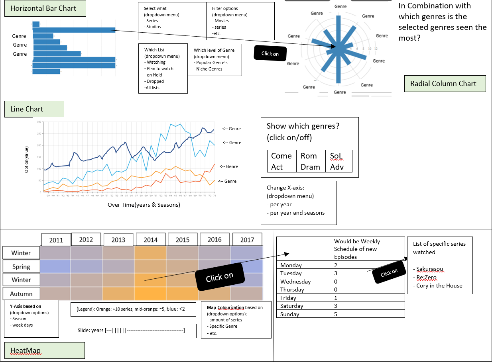

## DataVisualisationProject
###### Creator details
* Name: Julian Evalle
* Stud_ID: 11286369
* Orientation: Data Processing
###### Application Goal
To give better insight in the watching habits and patterns of anime viewers with a MAL-account

### Problem Statement
The MyAnimeList website gives a great documentation tool to keep track of the anime series you've seen, dropped or planned to watch. however it does not give a lot of insight into your preferences and watch patterns, especially when the account owner has seen +100 different series.

### Solution
Visualizing specific details to give a better insight into the account holder's preferences. Specifically genre preferences and seasonal preferences.

The MVP would be the horizontal bar chart, with the other visualization giving more details or other aspects of the user's viewing habits

### prerequisites
#### Dataset [MAL][mal]
Extract the information by crawling through each title in the list, specifically:
* Title
* Year of Release
* Season Release
* Day of episode release
* Genres
* Studio

Also obtain the same data from the tab: "Plan to Watch", "Dropped", "Currently Watching"

##### Data transformation
All the data needs to be reorganized so that every title belongs to a specific year and season and containing all its data

#### libraries
* Bar Chart: D3
* Radial Colum Chart: Bokeh
* Multi-line chart: D3 & D3 Multi-line chart
* HeatMap: AnyChart or AmCharts

#### similar
* the D3 example multi line chart [here](https://beta.observablehq.com/@mbostock/d3-multi-line-chart)
  * I will try something similar with fewer lines and more distinctive colouring and an option to remove specific lines
 with what each line represents (like in the sketch) I believe mine will be more informative on a grander scale
* the genre visualization on [this site](http://beckyryde.weebly.com/chart-of-preferred-genres.html)
  * A horizontal bar chart seems to be easier to intuitively see which genre is seen the most, compared to the others. Moreover the radial bar chart could be made as an extra to see with wich genres it is combined the most with
 
#### Hardest parts
* To make a universally applicable data structure for each visualization, else the least amount of structures necessary to visualize the data
* what to do with gaps in the data in the line chart when not a single show has been watch in that year, potentially select another form of visualization

[mal]: https://myanimelist.net/animelist/Goblok?status=2
