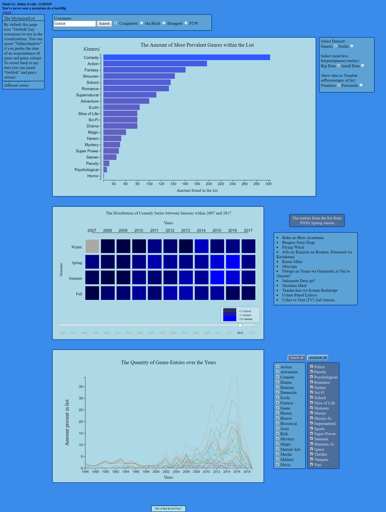
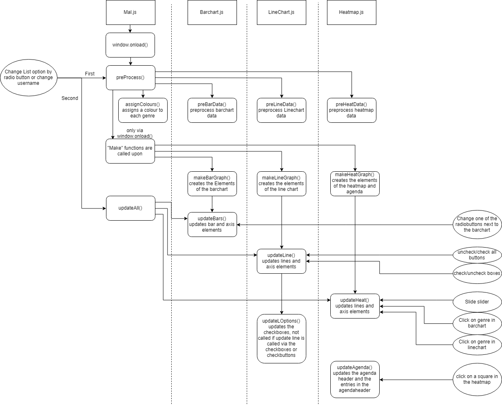

## Description of Application
The Application is meant to give insight in the users viewing habits in the context of anime and MyAnimeList.net(MAL) users. This application is insightful due to a lack of visualizations provided by the site itself, even though the data is present. The primary habits in question consist of Genre/Studio preference, seasonal distribution of watching specific genres and "anime-era"(a specific time frame in the history of anime) of preference.

## Technical Design
### Diagram
The general structure of each visualization file consists of a function that:
* preprocess data to something usable in the chart
* makes the SVG and elements like:
  * axis elements
  * label elements
  * option elements
* updates the chart and if necessary the axis, label and/or option elements
* updates the seperate element related to the visualization(e.g. agenda of the heatmap and checkboxes for the linechart)

* Square boxes: the JS file
* Rounded square boxes: functions
* oval boxes: user interaction  
  
(Typo below updateHeat(), should be update boxcolours)

### Data
#### Data Sources
The data source used is [MyAnimeList](myanimelist.net) accounts specifically:
* [Goblok](https://myanimelist.net/animelist/Goblok?status=3)
* [VellanShadow](https://myanimelist.net/animelist/VellanShadow?status=3)

#### Crawler
The Crawler can be found in "code/scraper/scrapemal.py" and makes use of Selenium, which allows python to open an executable browser window(in this case chrome) and extend the page to load all the data that can be presented by scrolling downwards.

After crawling the whole list, a JSON file containing the data is created and saved in the data folder. From this folder is where the JS files obtain the data used in the visualizations.

The JSON file names are structured like {username}_{list-type}.JSON with list-type representing the listnumber used in the URL of MAL.

#### Data Extracted
Data was extracted by crawling in Python and transformed to a JSON file  

Specific data that was extracted and used:
* title
* year
* season,
* genre(s)
* studio(s)

Specific data that was extracted and has potential to create user-interesting visualizations, but is not used:
* english title / synonyms
* month
* day
* episodes
* duration
* type

### Descriptions
#### User Data
The profile-data used by the visualization is by default "Goblok"(the creator's MAL-profile). From that point the user can either submit "VellanShadow" to use a seperate profile's data or "Goblok" to revert the data back to default data. If new data is scraped (seperate from the HTML and JS scripts) by scrapemal.py it can be immediately used if the username of that data is submitted. If the data cannot be found an error-alert will be shown. Further notice is that on a python-localhost the username submission is not case sensitive, however on the github server it is.  

Besides the submission the user can select which list to use, by radio button(Completed, on-hold, dropped, PTW(plan to watch)).

the submit and the radio buttons call upon all preprocessing and update functions.

#### Barchart
##### preBarData(): PreProcessing
The data is processed by going through all the data, adding the genre/studio to an genre or studio object and incrementing its value each time the same genre or studio is found. After that it divides the data into two sub-objects with the discriminating factor being below or equal/above the median of the found values within their respective object.

##### makeBarGraph(): creates the elements for the bargraph
Is only called once by the window.onload() and creates the SVG, axis, labels and the div with the barchart radiobuttons. Calls upon updateBars()

##### updateBars(): updates the bars, axis and labels
Updates the bars depending on which radio buttons are selected.
Is called upon each time a new list is chosen or the radio button selection besides the barchart is altered.

##### Interactivity Barchart
The main interactivity with the barchart consists of mouse-hovering which shows the amount or percentile value of the bar within the list. Furthermore clicking on a genre-bar will result in updating the heatmap to that genre within the list.

#### Linechart
##### preLineData(): PreProcessing
The data is processed by going through all the data, adding the entry to an array with a genre and year specific key. After that the missing years will be filled with empty arrays.

##### makeLineGraph(): creates the elements for the Linegraph
Is only called once by the window.onload() and creates the SVG, axis, labels. Calls upon the updateLine() function

##### updateLine(): updates the lines
Updates the lines depending on which checkboxes are checked.
Calls upon the updateLOptions() to generate the checkboxes representing the genres which can be found within the list.
Is called upon each time a new list is chosen or a change in checkbox is made. Skips updateLOptions() if no new checkboxes need te be made

##### updateLOptions(): updates the checkboxes
Removes, creates and updates the checkboxes besides the linechart. is called upon initialization and when a different list is selected

##### Interactivity Linechart
The main interactivity with the linechart consists of mouse-hovering which shows which genre the line represents. Furthermore clicking on a genre-line will result in updating the heatmap to that genre within the list. The linechart can be updated by selecting different lists or checking/unchecking checkboxes.

#### Heatmap
##### preHeatData(): PreProcessing
The data is processed by going through all the data, adding the entry to an array with a genre, year and season specific key. After that the missing years and/or missing season within will be filled with empty arrays.

##### makeHeatGraph(): creates the elements for the Heatgraph
Is only called once by the window.onload() and creates the SVG, axis, labels. Calls upon the updateHeat() function.

##### updateHeat(): updates the boxes, axis and labels
Updates the boxes depending on which genre is selected by barchart or linechart.
Is called upon each time a new genre is selected or the value of the slider has changed

##### updateAgenda(): updates the agenda besides the heatmap
Removes previous entries and inserts the entries from the year and season which are selected. is called upon each time a box is clicked

##### Interactivity Heatmap
The main interactivity with the heatmap consists of the slider, which updates the heatmap whenever the user slides it. Furthermore clicking on a box will result in the elements beside the heatmap showing which entries are present in the list in that year and season.  

## Challenges/Decisions
### General Changes
* Crawling the data took far longer than necessary, mainly due to the mindset of crawling every list in one sitting. However this was majorly inefficient due to slight interruptions resulting in losing all of the data.
  * This was made more time efficient by seperating each list in a seperate file and losing only the current list data when an error or interuption occured.
* Lay-out of chart order is changed than described in the proposal. bar-line-heat --> bar-heat-line.
  * this allows the user to see the heatmap alter itself depending on selection from the barchart and linechart. This results in the heatmap being more visually intriguing
* The selection of which list to use moved to its seperate div with the submit.
  * This makes the selection easier to find and the bar-radio-options less cluttered
* scraper bugs were found, for example picking up 2 studios seperated by a comma as a single studio.
  * This is fixed in preprocessing and in the scraper itself. The preprocessing is currently more of a precaution in case it is missed in another form.
* cancelled the idea of calling python in javascript to scrape a users data
  * this is due to concept of server and client side programming via AJAX seemed to be the easiest way to implements. However these were deemed to inefficient to learn given the timespan of this Project
  * to compensate, a second account was scraped to simulate the idea of scraping and showing a different users data. It is obtained by submitting "VellanShadow". Which has to be uppercase when used in the github server.
* All the JS functions were in one script, but are now divided in several scripts.
  * this makes the seperate functions easier to oversee and understand.
* Added an unplanned about.html page
  * gives more insight on the visualization page itself, if necessary.

### BarChart
* The data would be seperated by a dynamic number, instead of a absolute one
  * This makes it more likely to have a even split between small-data and big-data. The median has been chosen since the splitnumber has to be based on the values in the data and the mean and mode would be less optimal choices. The mean due to the possibility of very high numbers, which would shift the middle point too much. The mode, due to the possibility of a lot of small numbers, especially when it comes to studios, which would shift the splitnumber unfavorably.
  * studiomedian gets a +1 if it a really small number, splitting the data more evenly because at that point it probably due to a lot of studios of which the user has only seen a few productions of.
* selection of data would initially be by dropdown menu
  * this is changed to radiobuttons, due to the choices being easier to interpret when there are only 2 options.
* axis bug: labels were not-present or did not update themselves.
  * this was fixed due to [this](https://bl.ocks.org/shimizu/914c769f05f1b2e1d09428c7eedd7f8a) which show the proper separation of make and update functions. This is also how I eventually separated the heat and line chart functions, which due to it did not contain the same bug.
* bug with scaleband: all the genres were places on one spot
  * accidentaly placed all genres within an array when calling scaleband. fixed once the "[]" were removed
* bug with transitioning the bars: bars from previous data would not disappear.
  * this was due to the transition() coming before the .on() events and D3 probably does not understand how to transition those, so it just blanked.
* added gradient colouring to bars instead of each genre/studio having its own colour.
  * this gradient now accentuates that the small data is actually less prevalent entries within the list, due to having the same colouring as the data on the very bottom of the big-data. This makes the big and small data more associated with one another, instead of just being separate options.
  * also a somewhat neutral colour like blue is perfect, due to a genre or studio not being objectively better than one another, which may have been the case with different colour-gradient or different colours per bar.
* bug of non-existent studio names being present in the barchart
  * made the preprocessing more strict in filtering.
* noticed that labels were too small, when there are a lot of entries.
  * the tooltip now also shows what studio the bar represents, this helps when labels are too small to read comfortably.
  * Also labels scale in font-size depending on the amount of bars

### LineChart
* The linechart initially would have the option to see the season within the years as well along the x-axis.
  * This idea was dropped mainly due to uncertainty in how to structure the data and not adding anything to the visualizations, since the seperation of seasons within the year is already represented in the heatmap.
* Initially the line chart would have been influenced by the slider of the heatmap as well
  * However like the previous described decision, this would not add anything to the visualizations, since seeing the data on a smaller scale is already given by the heatmap and comparing genres(main function of the linechart) is already clear enough in its current state, without the need to zoom in on a range of years.
  * to compensate for the loss of linkage between visualization, the lines can also select a genre used in the Heatmap
* dropped the idea of representing studios
  * This would be very unintersting data, since studios at most only bring ~3 products per year and often nothing. Which would probably result in a lot of flat lines in the linechart in which the user cant differentiate between a lack of product or a lack of having watched anything from that studio. Which would make the linechart useless.
* line options would initially be a single box with clicking on the genres would add or remove a genre from the chart
  * this has been replaced with 2 separate divs containing checkboxes. This makes the oversight of genres easier to manage and find for the user and the programmer.
  * checkboxes were initially buggy due to being in one box. Fixed once separated between two divs which dynamically alter their length depending on the amount of genres present within that div.
* set up a colour array of 10 for the Linechart
  * this is due to the amount of lines present. Because of this there are not enough distinctive colours to sepearate each line equally.
  * also by giving each genre a colour, makes the linechart pre and post update less confusing. e.g. when a brown line suddenly gets pushed up or down due to a new max range, the user can still understand that it is the same line only lower or higher.
* checkbox bug, the checkboxes did not update themselves which resulted in errors due to the way the program selects genres.
  * the way the checkboxes are made is by obtaining all found genres in the initial list and making a checkbox for each. After that the program goes through each checkbox to see which is checked and which is not and uses  the checked boxes values to find the data. However when you switch list and a checked genre is not present within that list, it tries to find it but cannot which results in an error. This is fixed by making the checkboxes update-able.
* update checkbox bug, the checkboxes could not be unchecked
  * This was a difficult bug to fix. For startes the way the checkboxes were updates was by removing them all and creating newcheckboxes. however once they were created they could not be unchecked. This did not result in any errors which probably meant a logical error was present within the code. Eventually the bug was fixed. The reason for the bug existing was that whenever the lines were updates, so were the checkboxes. The default state of the checkboxes was checked, so when they were newly created during each update, they would return to checked. even when the update was called by unchecking a checkbox. So, by giving a variable to check in the line update whether the update was called via checkbox or something else and skipping the checkbox update depending on it fixed the bug.
* made the ticksize of the y-axis more dynamic.
  * at low numbers the y-axis would resort to decimal numbers, which made gauging values less intuitive. now it only shows integers in a way that duplicate numbers are not present. As far as I have looked there were no inbuild functions for preventing decimals and duplicate numbers at the same time, thus I made an updatable ticksize function.

### Heatmap
* initially the colouring would follow more standard colours like orange and blue representing heat
  * This changed to dark blue and lighter blue. First, this would fit more with blue theme present in the page and thus be more visually pleasing/coherent. Secondly, the difference in "heat" has no value. The only thing the user should intuitively see is which seasons contain more and which contain less. This is also seen in that the empty seasons have a grey box, else the user which is thoroughly intrigued by each seperate season(which is very common behaviour in anime-fans) has to check every single box if it contains any data and that would work frustratingly due to the amount of boxes and the lack of oversight it gives.
* The slidebar represents a range of years, instead of the beginning/end of the range.
  * This makes the heatmap more constant in lay-out and be slightly more comprehensive. The range of 10 years has been chosen, since it is quite likely that at least a single entry can be found in a range of 10 years. This prevents a completely grey heatmap in most cases, which would not be completely detrimental, but certainly more boring than an heatmap with at least 1 entry.
* dropped the idea of representing studios
  * (exact same reasoning as with the linechart). This would be very uninteresting data, since studios at most only bring ~3 products per year and often nothing. Which would probably result in a lot of grey boxes in which the user cant differentiate between a lack of product or a lack of having watched anything from that studio. Which would make the heatmap useless.
* Heatmap would initially also represent days, instead of only seasons.
  * This would be somewhat interesting to see, and would also make the agenda more of an actual agenda. However, this feature would not be missed by a significant amount of MAL-users, when compared with the seasonal representation the heatmap currently has. This is due to the concept of seasonal series being a huge aspect of anime-fans, whilst on which day something came out within the year is not.
* bug in the heatmap which would result in boxes sliding diagonally instead of only horizontally
  * bug was fixed due to ordering the data. The bug was most likely due to the order in which the boxes were implemented, which would be solved once the the data was ordered by year and season.
* bug due to preprocesing differences
  * due to the preprocess function of the heatmap and the barchart filtering different values. To explain the heatchart filters anything of which the season is "unknown", which the bardata does not. this results in values present in the bardata, which are not present in the heatdata. this was fixed by making the barchart and heatmap filter more like each other.
* heatmap did not update itself when a new list was selected
  * made an update all function which is called whenever a new list is selected, which calls all update functions
* The entries in the agenda are placed as list items
  * before only a newline seperated previous entries. By placing them as listitems, the agenda becomes more structured and easier for the user to gauge the amount.

### Defend Decision dropping Studios from other charts
As briefly discussed in the previous section. One of the biggest features I dropped was the representation of studios. This is because I realized that it would be uninteresting and a general waste of time to visualize in the other charts besides the barchart. The reason for this is due to production quantity of studios being very low, which would result in around ~3 entries at best within a year. Moreover it is possible that a studio did not produce anything in a year, which would make the yearly visualization futile. This is because the user is not sure whether lack of entries in that year is due to him/her not seeing anything of that studio within that year or if it is because the studio did not produce anything that year. Lastly, with how low the values would be, the charts would be rather boring to look at.

## Completeness of the Application
In general I would argue that it shows the most general intrigues of the MAL-users, which would leave them satisfied if they saw their own data to this extend. However as a user myself there are some things missing which I would greatly appreciate. First of all, the data shows the dates of when the series came out instead of when the user watched it himself. The problem however is that MAL does not disclose that information freely if it is recorded in their database(which it probably is). Furthermore I would be greatly interested in an all-including heatmap, instead of single genre heatmap, but due to a lack of time this was not implemented. Next, the initial idea which was present in the proposal, the radial chart, would be a really interesting extra. The purpose was to see which combination of genres are most prevalent in the current list. which would expand the insight the user would get by a significant amount. however there was no time for that and the currently chosen visualization are generally more interesting. Lastly a list with all entries of a genre, this would not be very hard to implement, however I came up with this rather late in the project and the html page is already quite cramped in space.
